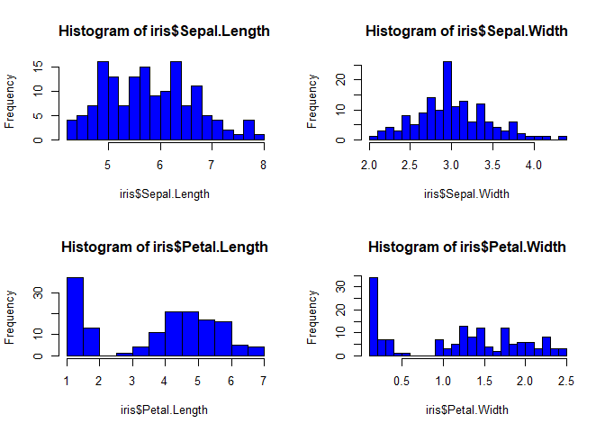
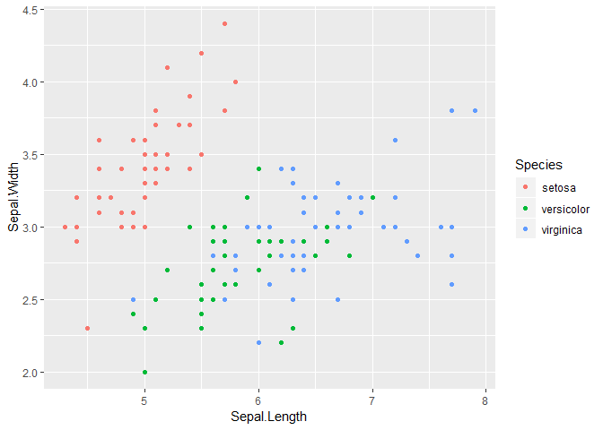
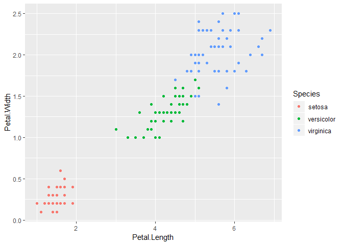
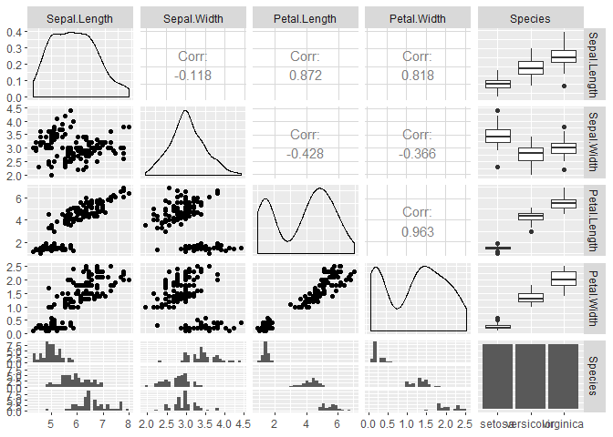
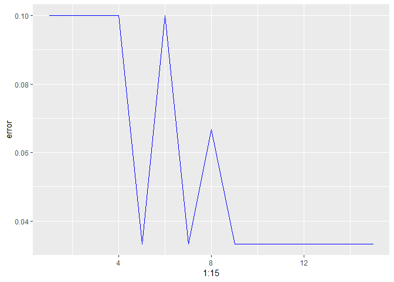

## Introduction

Iris dataset contains 150 observations and 5 variables. We have 50 flowers of each species.

* Variables `Sepal length`, `Sepal width`, `Petal length`, and `Petal width` are quantitative variables, describing the length and widths of parts of flowers in cm.
* Variable `Species` is categorical consisiting of three different species namely, setosa, versicolor and virginica.

We do an exploratory analysis on the dataset and build a classification model using K-nearest neighbours method

## Loading Libraries

The following packages have been loaded to perform the analysis:

```r
library(class)
library(ggplot2)
library(GGally)
```


## Summary Statistics

Summary statistics for each of the variable in the data is shown below:


```r
summary(iris)
apply(iris[,1:4], 2, sd)
```


## Exploratort Data Analysis

### Histogram plots

Below are the histogram showing the distribution of the quantitative variables `Sepal length`, `Sepal width`, `Petal length` and `Petal width`.


```r
par(mfrow=c(2,2))
hist(iris$Sepal.Length, col="blue", breaks=20)
hist(iris$Sepal.Width, col="blue", breaks=20)
hist(iris$Petal.Length, col="blue", breaks=20)
hist(iris$Petal.Width, col="blue", breaks=20)
```

<!-- -->

### Scatter plots

Checking the distribution of `Sepal width` vs `Sepal Length` and `Petal width` vs `Petal length`.
Basis the plot below, it is observed that `Virginica` has the maximum value for `Petal width` and `Petal length`.


```r
ggplot(data = iris, aes(x = Sepal.Length, y = Sepal.Width, col = Species)) +
  geom_point()
```

<!-- -->

```r
ggplot(data = iris, aes(x = Petal.Length, y = Petal.Width, col = Species)) +
  geom_point()
```

<!-- -->

### Correlation Matrix

From the correlation plot, we observe that:

* There is a strong positive correlation between `Petal length` and `Petal width` with a correlation coefficient of 0.963
* There is a strong positive correlation between `Petal width` and `Sepal length` with a correlation coefficient of 0.818
* There is a strong positive correlation between `Petal length` and `Sepal length` with a correlation coefficient of 0.872


```r
ggpairs(iris)
```

<!-- -->


## Classification using kNN

### Splitting the data for building the model

We now divide the Iris dataset into training and test dataset to apply KNN classification. 80% of the data is used for training while the KNN classification is tested on the remaining 20% of the data.


```r
set.seed(12420352)
iris[,1:4] <- scale(iris[,1:4])
setosa<- rbind(iris[iris$Species=="setosa",])
versicolor<- rbind(iris[iris$Species=="versicolor",])
virginica<- rbind(iris[iris$Species=="virginica",])


ind <- sample(1:nrow(setosa), nrow(setosa)*0.8)
iris.train<- rbind(setosa[ind,], versicolor[ind,], virginica[ind,])
iris.test<- rbind(setosa[-ind,], versicolor[-ind,], virginica[-ind,])
iris[,1:4] <- scale(iris[,1:4])
```


### Finding optimum value of k

The below plot shows the classification error for different values of k. We see that the error decreases initially but then starts increasing due to overfitting. It takes a constant value afterwards.


```r
error <- c()
for (i in 1:15)
{
  knn.fit <- knn(train = iris.train[,1:4], test = iris.test[,1:4], cl = iris.train$Species, k = i)
  error[i] = 1- mean(knn.fit == iris.test$Species)
}
```

From the below plot we see that minimum error is when value of k is eqal to 5 or 7. We chose the less complex model and go with k = 5.

```r
ggplot(data = data.frame(error), aes(x = 1:15, y = error)) +
  geom_line(color = "Blue")
```

<!-- -->


### Confusion Matrix 

The minimum error is observed at k = 5. Getting the confusion matrix and accuracy for the model:


```r
iris_pred <- knn(train = iris.train[,1:4], test = iris.test[,1:4], cl = iris.train$Species, k=5)

table(iris.test$Species,iris_pred)
```

```
##             iris_pred
##              setosa versicolor virginica
##   setosa         10          0         0
##   versicolor      0         10         0
##   virginica       0          1         9
```


We observe that the out of sample prediction accuracy at k = 5 is 96.67%


## Conclusion

We are able to create a KNN classifier which gives a prediction accuracy of **96.67%** on test dataset.
